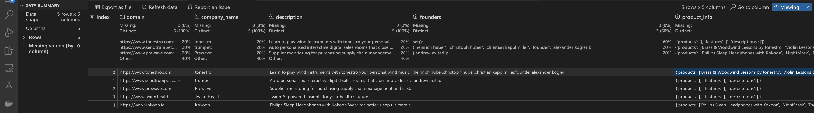

# Sequel Sift

An ETL and ML pipeline for extracting startup data, constructing quantitative tables, and calculating investment risk factors and Sequel Scores.





### Quick Start

#### Prerequisites
- Python 3.6+
- pip package manager
- Internet connection for web scraping

#### Installation
1. **Create and activate a virtual environment**
```bash
# Create virtual environment
python3 -m venv venv

# Activate virtual environment
# On Unix/macOS:
source venv/bin/activate
# On Windows:
venv\Scripts\activate
```

2. **Install dependencies**
```bash
pip install -r requirements.txt
```

3. **Launch the data extraction**
```bash
python sift.py
```

### Workflow

#### Data Extraction
- Fetches web content from startup company websites
- Handles URL normalization and retry logic for reliable scraping
- Extracts key information from HTML content:
  - Company names
  - Company descriptions
  - Founder information
  - Product details and features
  - About page content

#### Data Processing
- Text cleaning and normalization
- Natural Language Processing for entity extraction
- Proper noun identification for company names
- Founder name extraction from context
- Product information categorization

#### Features
- Robust retry mechanism with exponential backoff
- Intelligent company name extraction using NLP
- Multi-source information gathering
- Duplicate removal with order preservation
- Error handling and logging

#### Output Format
Data is returned in a pandas DataFrame with the following columns:
- domain: Website URL
- company_name: Extracted company name
- description: Company/product description
- founders: Set of founder names
- product_info: Dictionary containing:
  - products: List of product names
  - features: List of product features
  - descriptions: List of product descriptions

### Testing

Run the test suite:
```bash
python test_sequel_sift.py
```

### Project Structure
```
sequel_sift/
├── sift.py            # Main implementation
├── test_sequel_sift.py # Test suite
├── requirements.txt    # Dependencies
└── README.md          # Documentation
```

### Dependencies
- requests: Web scraping
- beautifulsoup4: HTML parsing
- nltk: Natural language processing
- pandas: Data organization
- re: Regular expressions
- urllib: URL handling

### Next Steps
- Implement OpenAI integration for enhanced information extraction
- Add ML models for risk factor analysis
- Develop Sequel Score calculation
- Create data visualization components
- Build API endpoints for data access

### References
- [5 Q's for Philipp Omenitsch CTO of Sequel](https://datainnovation.org/2024/06/5-qs-for-philipp-omenitsch-cto-of-sequel/)

### Author
Emmanuel Ezenwere

### Version
1.0.0


## Q&A


#### What is our goal with this website:


- Efficiently identify promising startups that match Sequel's investment thesis
- Create a data-driven approach to early-stage investing
- Generate insights about successful startup patterns
- Build a community of founders and investors
- Create a tool to help founders improve and optimize their pitchdecks


#### How would you improve this product:


- Add competitive analysis features
- Create founder success pattern recognition
- Add automated due diligence checklists
- Add more AI coach product pictures to the website
- Extend the capabilities of Sequel's AI coach and Sequel Score Model, [Sequel Score Model Proposal.pdf](SequelScoreModelProposal.pdf) attached.
- Implement robust data science experiment design structure to test effectiveness of Sequel AI coach , A/B Tests.
- Use user feedback to improve the product until Product Market Fit


#### How can we combine Pitch Decks and Website Crawling:

Data Integration:

Cross-validate claims made in pitch decks with website data
Track changes in company positioning over time
Verify team information and growth
Compare market sizing claims with actual market presence


Analyze Opportunities:

Track execution against pitched roadmap
Identify red flags and discrepancies
Monitor product evolution
Validate customer testimonials
Track milestone achievement


Automated Insights:

Generate comprehensive company profiles
Create growth trajectory predictions
Identify market positioning shifts
Monitor competitive landscape changes
Track product development velocity
